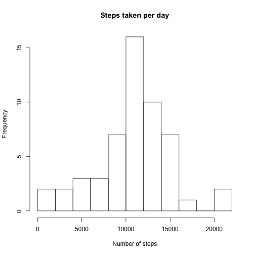
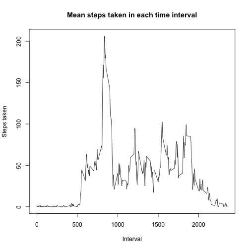
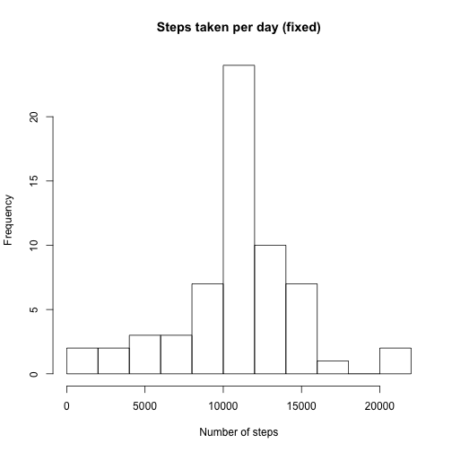
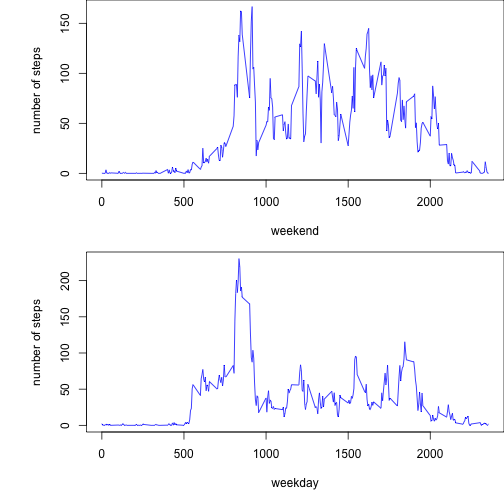

Reproducible Research Project 1
===============================

We start by loading the data:


```r
library(plyr)
data<-read.csv('activity.csv',colClasses=c('integer','Date','numeric'))
```

```
## Warning in file(file, "rt"): cannot open file 'activity.csv': No such file
## or directory
```

```
## Error in file(file, "rt"): cannot open the connection
```

Removine the na values, and plot a histogram of the total number of steps taken


```r
non_na_summer <- function(x){
  if (all(is.na(x))) return(NA)
  else return(sum(x[!is.na(x)]))
}
tot_steps<-aggregate(data$steps,by=list(data$date),FUN=non_na_summer)
hist(tot_steps$x,main='Steps taken per day',xlab='Number of steps',breaks=10)
```

 

Median number of steps:


```r
median(tot_steps$x,na.rm=T)
```

```
## [1] 10765
```

Mean number of steps:

```r
mean(tot_steps$x,na.rm=T)
```

```
## [1] 10766.19
```

Average the number of steps by time interval, plot the result:


```r
non_na_meaner <- function(x){
  if (all(is.na(x))) return(NA)
  else return(mean(x[!is.na(x)]))
}

interval_mean_steps<-aggregate(data$steps,by=list(data$interval),FUN=non_na_meaner)
plot(interval_mean_steps$Group.1,interval_mean_steps$x,type='l',main='Mean steps taken in each time interval',xlab='Interval',ylab='Steps taken')
```

 

Compute the time interval with maximal number of steps:


```r
max_steps<-max(interval_mean_steps$x)
interval_mean_steps[interval_mean_steps$x==max_steps,]$Group.1
```

```
## [1] 835
```

Total number of missing values (nas):


```r
tot_nas<-sum(is.na(data$steps))
```

Fill in missing data with mean value from that time interval


```r
fixed_data<-data
fixed_data$means<-interval_mean_steps$x
fixed_data<-mutate(fixed_data,steps=ifelse(is.na(steps),means,steps))
fixed_data$means<-NULL
```

Consider resulting histogram:


```r
fixed_tot_steps<-aggregate(fixed_data$steps,by=list(fixed_data$date),FUN=sum)
hist(fixed_tot_steps$x,main='Steps taken per day (fixed)',xlab='Number of steps',breaks=10)
```

 

Fixed median:


```r
median(fixed_tot_steps$x)
```

```
## [1] 10766.19
```

Fixed mean:

```r
mean(fixed_tot_steps$x)
```

```
## [1] 10766.19
```

Introduce weekend/weekday factor:


```r
fixed_data$day_type<-as.factor(ifelse(weekdays(fixed_data$date) %in% c('Saturday','Sunday'),'weekend','weekday'))
```

Finally, plot activity when separated by this factor:


```r
weekday_data<-fixed_data[fixed_data$day_type=='weekday',]
weekend_data<-fixed_data[fixed_data$day_type=='weekend',]
weekday_mean<-aggregate(weekday_data$steps,by=list(weekday_data$interval),FUN=mean)
weekend_mean<-aggregate(weekend_data$steps,by=list(weekend_data$interval),FUN=mean)

par(mfrow=c(2,1),mar=c(5,6,0,0))

plot(weekend_mean$Group.1,weekend_mean$x,type='l',xlab='weekend',ylab='number of steps',col='blue')
plot(weekday_mean$Group.1,weekday_mean$x,type='l',xlab='weekday',ylab='number of steps',col='blue')
```

 
